# デイトレ自動化システム 設計書

## 目的
今日やったデイトレ（銘柄調査 → チャート分析 → 発注 → 利確・損切）を段階的に自動化する。

---

## 使用ツール構成

| カテゴリ | ツール | 料金 | 備考 |
|----------|--------|------|------|
| AI開発環境 | Claude Code | 月$20〜$100 | コード生成・実行・修正 |
| 実行環境 | Python 3.10以上 | 無料 | Claude Codeが自動セットアップ |
| 発注API | kabuステーションAPI（三菱UFJ eスマート証券） | 無料 | 口座開設申請済み・審査中 |
| 株価データ | J-Quants API | 月1,650円（ライトプラン） | スクリーニング・バックテスト用 |
| 適時開示 | TDnet（株探スクレイピング） | 無料 | 引け後適時開示情報 |
| ニュース取得 | 株探スクレイピング | 無料 | 銘柄別ニュース・会社名 |
| 地合いチェック | Yahoo Finance API | 無料 | NYダウ・ナスダック終値 |
| 材料判定 | Claude API (Sonnet 4.5) | 従量課金（1日約6円） | ニュース内容のAI判定 |
| 通知 | Discord Webhook | 無料 | スクリーニング結果・エントリー/決済通知 |
| チャート分析 | J-Quants API + Python（数値計算） | 無料〜 | VWAP・MA・上昇率をAPI取得＆計算で判定 |

### 証券口座について
- **三菱UFJ eスマート証券**を使用（口座開設申請済み・審査中）
- 口座開設完了後：kabuステーションをインストールしてAPIを有効化
- kabuステーションAPI：localhost:18080で使用可能（無料）

---

## 自動化フロー

### 実行スケジュール

```
【夜間バッチ】毎朝6:30 自動実行（NY市場引け後）
  morning_screening.py
  └─ 全ての情報が出揃ってから実行するのがポイント
     ・前日引け後の適時開示（TDnet）✅
     ・NY市場の結果・為替の落ち着き ✅
     ・PTSの動向 ✅

【当日】8:20  kabuステーション起動確認（安全装置）
【当日】9:00〜 エントリー判断（候補リストを元に）
【当日】9:30〜10:30 パターンBのエントリー監視
【当日】15:20 全ポジション強制決済
```

### morning_screening.py（毎朝6:30実行）

```
STEP 1a: J-Quants APIで出来高急増銘柄を抽出
  → 直近20日平均出来高の2倍以上
  → 4桁コード（1000-9999）のみ対象
  → ETF・ETN・REIT除外（市場区分で判定）
  → 1単元（100株×株価）≤ 買付余力（80万円）
  → 実装ファイル: src/screening/screener.py

STEP 1b: TDnet引け後適時開示を取得
  → 前日15:30〜当日6:00の開示を全件取得
  → 対象：業績修正（上方）・決算・株式分割・自社株買い
  → 開示があった銘柄コードを抽出
  → 実装ファイル: src/utils/tdnet_scraper.py

STEP 1c: 両ソースを合算・重複除去
  → 候補プール（〜118銘柄程度）

STEP 2: 地合いチェック（スキップ判定）
  → NYダウ・ナスダック終値をYahoo Finance APIで取得（リトライ3回）
  → 判定：
      NYダウ -2%以上 かつ ナスダック -2%以上 → skip_all（全スキップ）
      どちらか一方が -2%以上               → volume_only（出来高急増のみ対象）
      両方 -2%未満                         → normal（通常通り全候補を対象）
      データ取得失敗                       → normal（フォールバック）
  → 実装ファイル: src/utils/market_sentiment.py

STEP 3: 各銘柄のニュース取得
  → 株探の銘柄ニュースページをスクレイピング（最新3件）
  → テーブル形式のニュースを抽出（[日付] タイトル）
  → 会社名も取得
  → 実装ファイル: src/utils/news_scraper.py

STEP 4: Claude APIで材料判定
  → 上位10銘柄について、ニュース+出来高急増情報をClaude Sonnet 4.5に渡す
  → 以下をJSON形式で取得：
      has_material: true/false
      material_type: 決算好調/業績上方修正/株式分割/自社株買い/テーマ株/その他
      strength: 強/中/弱
      summary: 材料の内容（一行）
  → has_material=false → 候補から除外
  → 実装ファイル: src/utils/material_judge.py

STEP 5: 最終候補リスト出力
  → candidates_YYYYMMDD.csv として保存
  → 内容：コード・銘柄名・終値・出来高急増率・25日移動平均等
  → 実装ファイル: src/screening/screener.py

STEP 6: Discord通知送信
  → 朝スクリーニング結果をDiscord Webhookで送信
  → 内容：候補銘柄数、地合い情報、上位5銘柄の詳細（コード・企業名・材料サマリー）
  → 実装ファイル: src/utils/notifier.py
```

### 当日リアルタイム処理（kabuステーション連携後）

```
STEP 6: エントリー判断（5分ごと実行）
  → 候補リストの各銘柄について check_entry() を実行
  → パターンA：9:00〜（寄り付きと同時）
  → パターンB：9:30〜10:30（VWAPタッチ後反発確認）

STEP 7: 注文実行
  → kabuステーションAPIで買い注文
  → 利確指値・損切逆指値を同時セット

STEP 8: ポジション監視（5分ごと）
  → 利確・損切の約定確認
  → 11:30前場引け・15:20強制決済
```

---

## 開発フェーズ（ロードマップ）

### フェーズ1：環境構築（完了 ✅）
- [x] Claude Codeのインストール・ログイン（v2.0.15）
- [x] Pythonのセットアップ（Python 3.13.12）
- [x] J-Quants APIのアカウント登録・Lightプラン加入
- [x] J-Quants APIキー取得・設定
- [x] gitリポジトリ初期化・GitHubリポジトリ作成（kosukeiOrbit/auto-daytrade）
- [ ] kabuステーションのインストール・API有効化（口座開設完了後）
- [ ] TDnet MCPの設定

### フェーズ2：スクリーニング自動化（完了 ✅）
- [x] J-Quants API ClientV2 統合
- [x] 全銘柄データ取得スクリプト作成
- [x] フィルタ条件の実装（上昇率+3%・売買代金上位20・予算80万円以内）
- [x] 候補銘柄リストのCSV出力
- [x] 動作確認・精度検証（2026-03-12：16銘柄、平均上昇率8.85%、最大23.54%）
- [x] **【改訂】出来高急増フィルタに変更**（20日平均出来高の2倍以上）
- [x] **【改訂】4桁コードフィルタ実装**（ETF等の5桁コード除外）
- [x] **【改訂】ETF・ETN・REIT除外フィルタ追加**（市場区分で判定）
- [x] **【新規】TDnet引け後適時開示取得**（前日15:30〜当日6:00の開示）
- [x] **【新規】NYダウ・ナスダック終値で地合いチェック**（Yahoo Finance API、リトライ処理付き）
- [x] **【新規】株探ニューススクレイピング**（最新3件のニュース取得）
- [x] **【新規】Claude APIで材料判定**（has_material, material_type, strength, summaryを自動判定）
- [ ] **【新規】毎朝6:30 Windowsタスクスケジューラ自動実行**

### フェーズ3：数値ベースチャート判定（完了 ✅）
- [x] VWAP・移動平均をPythonで計算する関数実装
- [x] エントリー判定ロジックの実装（パターンA・B）
- [ ] kabuステーションAPIでリアルタイムOHLCV取得（口座開設完了後）
- [ ] 5分ごとの定期実行設定（Windowsタスクスケジューラ）

### フェーズ4：Discord通知機能（完了 ✅）
- [x] Discord Webhook通知クラス実装（DiscordNotifier）
- [x] 朝スクリーニング結果通知（send_morning_report）
  - 候補銘柄数、材料判定結果、地合い情報、TDnet開示件数
  - 上位5銘柄の詳細（コード・企業名・出来高急増率・終値・材料サマリー）
- [x] エントリーシグナル通知（send_entry_signal）※フェーズ5で使用
- [x] 決済通知（send_exit）※フェーズ5で使用
- [x] エラー通知（send_error）
- [x] .env.exampleとconfig.pyにDISCORD_WEBHOOK_URL設定を追加
- [x] morning_screening.pyとtest_morning_notification.pyに統合
- [x] 企業名表示機能（judgmentsに企業名を追加）
- [x] 動作確認・通知テスト完了

### フェーズ5：判定精度の検証（一部完了 ✅）
- [x] トレードシミュレーター実装（ポジション管理・損益計算・資金管理）
- [x] パフォーマンス指標計算（勝率・PF・R倍数・DD・連勝連敗）
- [x] バックテストエンジン実装
- [x] 合格基準クリア確認（勝率70%・R倍数2.03・最大DD-0.42%）
- [x] 統合バックテスト実装（スクリーニング→エントリー判定→シミュレーション一気通貫）
- [x] 実データ9営業日（2026-03-02〜03-12）でのバックテスト実行・動作確認
- [x] バックテスト結果の可視化（資金曲線・トレードタイムライン・パフォーマンスサマリー）
- [x] 日足近似バックテスト改善（始値エントリー・損切/利確ロジック・VWAP近似・ギャップアップ除外）
  - 銘柄83060：2026-03-05 始値2,745円→損切2,718円（-1.00%, -2,745円）
  - 最大DD -0.55% が正しく可視化されることを確認
- [ ] 5分足データを使った精密なバックテスト（kabuステーション連携後）
- [ ] パラメータチューニング機能の追加

### フェーズ6：自動発注（口座開設完了後）
- [ ] kabuステーション APIセットアップ（口座開設審査中）
- [ ] kabuステーションAPIから買付余力を動的取得し、Screener(budget=...)に渡すようmorning_screening.pyを修正（現在は800000固定、INVESTMENT_RATIO=0.95を.envで設定可能にする）
- [ ] Discord通知に「本日の投資予算: XX万円」を追加
- [ ] kabuステーションAPIで買い注文の発注
- [ ] 逆指値・利確注文のセット
- [ ] 安全装置の実装
- [ ] ペーパートレードで十分な検証（数十回・数週間以上）
- [ ] 少額での本番運用開始

---

## 安全装置（必須）

自動発注を実装する際は以下を必ず組み込む。

| 安全装置 | 内容 |
|----------|------|
| 買付余力の動的取得 | 毎朝kabuステーションAPIから買付余力を取得し、スクリーニング上限に自動反映 |
| 損切ラインの自動設定 | エントリー時に必ずセット（VWAP割れ基準） |
| **日次最大損失で即停止** | **1日の損失が-3%（約-15,000円）に達したら即座に全停止・新規発注禁止** |
| **連敗停止** | **3連敗で当日の新規エントリーを停止** |
| 同時保有銘柄数上限 | 同時に保有する銘柄は1銘柄のみ（集中投資・複雑化防止） |
| 板異常時スキップ | 特別気配・売買停止・スプレッド異常の銘柄は発注しない |
| API未起動チェック | kabuステーションが起動しているか朝8:20に確認。未起動なら全処理停止 |
| 通信断・異常時の緊急停止 | API応答なし・PCスリープ復帰時は即座に保有確認→全クローズ |

### バックテスト合格基準（フェーズ4終了の判定条件）

本番移行前に以下をすべて満たすこと。

| 指標 | 合格基準 |
|------|---------|
| 勝率 | 55%以上 |
| 平均R倍数（利益÷損失） | 1.5以上 |
| 最大連敗 | 5連敗以内 |
| 最大ドローダウン | -10%以内 |
| パターンA/B別の勝率 | 両方とも50%以上 |
| 寄り付き直後（9:00〜9:05）の約定ズレ | 想定価格の±0.5%以内 |

---

## スクリーニング条件（改訂版）

### 旧設計との違い

| 項目 | 旧設計 | 新設計 |
|------|--------|--------|
| 実行タイミング | 当日9:00〜（寄り付き後） | **前日夜〜当日6:30（NY引け後）** |
| 候補発見の軸 | 前日比+3〜+8%の上昇率 | **出来高急増 × 引け後適時開示** |
| 材料判定 | なし | **Claude APIで自動判定** |
| 地合いチェック | なし | **NYダウ・ナスダック終値で判定** |
| 引け後材料 | 拾えない | **TDnet MCPで取得** |

### STEP 1a：出来高急増フィルタ
```
直近20日平均出来高の 2倍以上
× 株価が25日移動平均以上（上昇トレンド継続）
× 1単元（100株×終値）≤ 買付余力
× ETF・ETN・REIT・優先株 除外
× 前日ストップ高銘柄 除外
```

### STEP 1b：TDnet引け後適時開示フィルタ
```
前日15:30〜当日6:00の開示を対象
取得方法：
  ・TDnetのHTML（https://www.release.tdnet.info/inbs/I_list_YYYYMMDD_01.html）をスクレイピング
  ・決算短信・業績修正等のポジティブ開示を抽出
  ・開示があった銘柄コードをリスト化
注意：
  ・TDnetのテーブルが見つからない場合は0件として処理
  ・現在の実装では開示種別のフィルタは未実装（全開示を取得）
実装ファイル：src/utils/tdnet_scraper.py
```

### STEP 2：地合いチェック
```
NYダウ終値・ナスダック終値を取得して判定：

  両方 -2%以上下落  → 全スキップ（今日は見送り）
  どちらか -2%以上  → 出来高急増銘柄のみ対象（適時開示銘柄は除外）
  両方 -2%未満      → 通常通り全候補を処理

※ 日経先物（SGX）も参考値として取得・ログ保存
```

### STEP 4：Claude API材料判定（実装済み）
```python
# 各銘柄に対してClaude Sonnet 4.5 APIを呼び出す（上位10銘柄のみ）
# 実装ファイル: src/utils/material_judge.py

入力：
  - 銘柄コード
  - 企業名
  - ニューステキスト（株探から取得した最新3件）
  - 出来高急増情報

出力（JSON形式）：
  {
    "has_material": true/false,
    "material_type": "決算好調|業績上方修正|株式分割|自社株買い|テーマ株|その他",
    "strength": "強|中|弱",
    "summary": "材料の内容（簡潔に）"
  }

除外ロジック：
  - has_material=false の銘柄は候補から除外
  - should_exclude() メソッドで判定
```

**コスト試算**：Claude Sonnet 1回≒$0.003 × 10銘柄 = **1日約3〜6円以下**

---

## エントリータイミング（2パターン）

寄り付き直後（9:00〜9:30）は最も価格が荒れる時間帯のため、候補銘柄の発見タイミングによってエントリー戦略を分ける。

### パターンA：前日〜朝に候補が決まっている銘柄
**対象**：前日大引け後または当日朝のスクリーニングで候補リストに入っていた銘柄

```
エントリー可能時間：9:00〜（寄り付きと同時に判断）
条件：
  - ギャップアップ（前日終値より高く寄り付く）を確認
  - 寄り付き後に出来高が急増している
  - チャートAI判定が entry: true
```

**根拠**：前日夜に候補が決まっているため、寄り付き価格を見た瞬間にギャップアップ確認→即エントリーの判断ができる。9:05まで待つ理由がなく、最初の1〜2分が最も値幅が大きいため遅れるほど旨味が減る。

### パターンB：当日寄り付き後に動意が出てきた銘柄
**対象**：9:00以降に急騰しはじめ、スクリーニングに新たに引っかかってきた銘柄

```
エントリー可能時間：9:30〜10:30
条件：
  - VWAPを下回らずに一度押してから再上昇している
  - 押し目でVWAPタッチ or 5分MAタッチを確認
  - チャートAI判定が entry: true
```

**根拠**：当日動意の銘柄は9:00〜9:30の荒れた時間をやり過ごし、モメンタム継続を確認してから乗る。

### 共通ルール（両パターン共通）
| ルール | 内容 |
|--------|------|
| 最終エントリー期限 | **10:30まで**。それ以降の新規エントリーは原則禁止 |
| 高値圏除外 | **寄り付き価格**が前日比+8%超の銘柄は当日除外。寄り付き後に+8%超になった場合は**現時点の上昇率で再判断**（+8%未満に戻れば対象に復活） |
| 前日ストップ高除外 | ギャップダウンリスクが高いため対象外 |
| 決算またぎ除外 | 当日・翌日決算銘柄は対象外 |

### 決済ルール
```
【通常決済】
- 利確ライン（+2%）到達 → 指値で自動決済
- 損切りライン（-1%、VWAP割れ）→ 逆指値で自動決済

【時間決済（強制）】
- 11:30（前場引け）：含み損ポジションは強制成行決済（含み益は後場継続可）
- 15:20（大引け10分前）：全ポジション強制決済（日またぎ禁止）
  ※大引けは2024年11月より15:30に延長。15:00決済は機会損失になるため修正。
```

---

## チャート出来高の読み方（重要）

### ⚠️ 5分足チャートのヘッダー出来高に注意
TradingViewなどの5分足チャートで画面上部に表示される出来高数値（例：「出来高 174.2K」）は、**現在進行中の5分足バー1本のその時点までの累積出来高**である。

- バー切り替え直後は小さく、5分経つにつれて積み上がるため、**タイミングによって全く異なる数値になる**
- この数値単体を「出来高が多い/少ない」の判断材料にしてはいけない

### ✅ 正しい出来高の見方
1. **完成したバー（過去の足）の棒グラフ高さを相対比較する** → 今日の寄り付き足が過去と比べて多いかを棒グラフの高さで視覚的に判断
2. **出来高急増のパターンを見る** → 棒グラフが突然伸びた足は大口・機関が動いたサイン
3. **現在進行中のバーのヘッダー数値はあくまで参考程度**

---

## エントリー判定ロジック（数値ベース・叩き台）

画像解析は使わず、APIで取得した数値をPythonで計算して判定する。

```python
def check_entry(symbol: str, ohlcv: list, current_price: float, prev_close: float) -> dict:
    """
    エントリー判定関数（叩き台）
    
    Parameters:
        symbol: 銘柄コード
        ohlcv: 当日の5分足データ [{"open", "high", "low", "close", "volume", "time"}, ...]
        current_price: 現在値
        prev_close: 前日終値
    """

    # 1. 前日比上昇率チェック
    open_price = ohlcv[0]["open"]  # 寄り付き価格
    gap_rate = (open_price - prev_close) / prev_close * 100
    current_rate = (current_price - prev_close) / prev_close * 100

    if gap_rate > 8.0:
        return {"entry": False, "reason": "寄り付きギャップアップ+8%超・当日除外"}
    if current_rate > 8.0:
        return {"entry": False, "reason": "現時点上昇率+8%超・一時除外"}

    # 2. VWAP計算（当日始値から現在まで）
    cum_tp_vol = sum((b["high"] + b["low"] + b["close"]) / 3 * b["volume"] for b in ohlcv)
    cum_vol = sum(b["volume"] for b in ohlcv)
    vwap = cum_tp_vol / cum_vol if cum_vol > 0 else 0

    if current_price < vwap:
        return {"entry": False, "reason": "VWAP割れ"}

    # 3. トレンド判定（直近5本の終値が上昇トレンドか）
    recent = ohlcv[-5:]
    closes = [b["close"] for b in recent]
    is_uptrend = closes[-1] > closes[0] and closes[-1] > closes[2]

    if not is_uptrend:
        return {"entry": False, "reason": "上昇トレンドではない"}

    # 4. VWAPタッチ確認（直近5本でVWAP付近に触れたか）
    vwap_touched = any(b["low"] <= vwap * 1.005 for b in recent)

    if not vwap_touched:
        return {"entry": False, "reason": "VWAPタッチ未確認・飛びつき禁止"}

    # 5. エントリー可
    stop_loss = round(vwap * 0.99, 0)       # VWAP-1%
    take_profit = round(current_price * 1.02, 0)  # +2%

    return {
        "entry": True,
        "entry_price": current_price,
        "stop_loss": stop_loss,
        "take_profit": take_profit,
        "vwap": round(vwap, 0),
        "gap_rate": round(gap_rate, 2),
        "current_rate": round(current_rate, 2),
        "reason": "全条件クリア"
    }
```

### 判定ロジックの主要パラメータ（チューニング対象）
| パラメータ | 初期値 | 説明 |
|-----------|--------|------|
| 高値圏除外（寄り付き） | +8% | 寄り付きギャップアップの上限 |
| 高値圏除外（現在値） | +8% | 現時点の上昇率の上限 |
| VWAPタッチ判定幅 | VWAP×1.005 | VWAP付近とみなす範囲 |
| トレンド判定本数 | 直近5本 | 右肩上がり確認に使う足数 |
| 利確ライン | +2% | 第1利確目標 |
| 損切ライン | VWAP-1% | 損切基準 |

---

## 費用まとめ

### 初期費用
- なし（口座開設申請済み・審査中）

### 月額費用
| ツール | 料金 |
|--------|------|
| Claude Code | $20〜$100（利用量による） |
| J-Quants API | 1,650円（ライトプラン） |
| **合計目安** | **約3,000〜17,000円/月** |

### 無料ツール
- kabuステーションAPI（三菱UFJ eスマート証券）
- Python
- TDnet MCP

---

## 注意事項

1. **現物取引のみ** ― 信用取引は損失が投資額を超えるリスクあり、自動化との組み合わせは危険
2. **少額から開始** ― 最初は10〜30万円程度。仕組みが安定してから段階的に増額
3. **検証順序を守る** ― バックテスト → ペーパートレード（数週間）→ 本番
4. **kabuステーションの起動を忘れずに** ― APIはkabuステーション起動中のみ有効

---

## システムシーケンス図

朝スクリーニング（morning_screening.py）の実行フローを可視化したシーケンス図です。

```mermaid
sequenceDiagram
    autonumber
    participant TS as Windowsタスクスケジューラ
    participant MS as morning_screening.py
    participant SC as Screener<br/>(screener.py)
    participant JQ as J-Quants API
    participant TD as TDnet<br/>(tdnet_scraper.py)
    participant MK as MarketSentiment<br/>(market_sentiment.py)
    participant YF as Yahoo Finance API
    participant NS as NewsScraper<br/>(news_scraper.py)
    participant KB as 株探
    participant MJ as MaterialJudge<br/>(material_judge.py)
    participant CA as Claude API
    participant DN as DiscordNotifier<br/>(notifier.py)
    participant DC as Discord (スマホ)
    participant CS as candidates_YYYYMMDD.csv

    Note over TS,DC: 毎朝 6:30 自動起動（月〜金）

    TS->>MS: 起動

    rect rgb(30, 60, 90)
        Note over MS,JQ: STEP 1a｜出来高急増スクリーニング
        MS->>SC: get_volume_surge_candidates()
        SC->>JQ: 株価データ取得（過去30日）
        JQ-->>SC: 全銘柄OHLCV
        SC->>JQ: 銘柄マスタ取得（/v1/listed/info）
        JQ-->>SC: MarketCodeName（ETF判定用）
        SC-->>MS: 118銘柄（ETF/REIT除外・4桁・80万円以内）
    end

    rect rgb(30, 80, 60)
        Note over MS,TD: STEP 1b｜TDnet引け後開示取得
        MS->>TD: get_disclosures()
        TD->>TD: 前日15:30〜当日6:00のURL生成
        TD-->>MS: 上方修正・決算・株式分割など（下方修正は除外）
    end

    rect rgb(80, 50, 30)
        Note over MS,YF: STEP 2｜地合いチェック
        MS->>MK: check_sentiment()
        MK->>YF: NYダウ・ナスダック終値取得（リトライ3回）
        YF-->>MK: 前日比
        MK-->>MS: normal / volume_only / skip_all
    end

    alt skip_all（両指数 -2%以上）
        MS->>DN: send_error("地合い悪化・本日スキップ")
        DN->>DC: 🚨通知
    else normal or volume_only
        rect rgb(60, 30, 80)
            Note over MS,KB: STEP 3｜株探ニュース取得（上位10銘柄）
            loop 上位10銘柄
                MS->>NS: get_news(code)
                NS->>KB: スクレイピング（0.5秒待機）
                KB-->>NS: 直近ニュース一覧
                NS-->>MS: ニューステキスト
            end
        end

        rect rgb(60, 60, 20)
            Note over MS,CA: STEP 4｜Claude API 材料判定
            loop 上位10銘柄
                MS->>MJ: judge(code, news_text)
                MJ->>CA: has_material / strength / material_type / summary / risk
                CA-->>MJ: 判定結果
                MJ-->>MS: 採用 or 除外
            end
        end

        Note over MS,CS: STEP 5｜CSV出力
        MS->>CS: candidates_YYYYMMDD.csv 保存

        Note over MS,DC: STEP 6｜Discord通知
        MS->>DN: send_morning_report(candidates_df)
        DN->>DC: 📊朝スクリーニング結果（上位5銘柄・材料付き）
    end

    Note over DC: スマホに通知着信 🔔
```



### シーケンス図の説明

1. **STEP 1a**: J-Quants APIから過去30日分の株価データを取得し、出来高急増銘柄をスクリーニング
2. **STEP 1b**: TDnetから前日引け後〜当日早朝の適時開示を取得
3. **STEP 2**: Yahoo Finance APIでNYダウ・ナスダック終値を取得し、地合いを判定
4. **STEP 3**: 株探から上位10銘柄のニュースをスクレイピング
5. **STEP 4**: Claude APIで各銘柄の材料を判定（has_material, strength, material_type）
6. **STEP 5**: 最終候補リストをCSV出力
7. **STEP 6**: Discord Webhookで朝スクリーニング結果を通知

---

## フェーズ6 実装メモ（Claude Codeへの依頼内容）

### 買付余力の動的取得
- kabuステーションAPI `GET /kabusapi/account/wallet/cash` で現物買付余力を取得
- `config.py` に `INVESTMENT_RATIO = float(os.getenv('INVESTMENT_RATIO', '0.95'))` を追加
- `morning_screening.py` の `Screener(budget=800000)` を
  `Screener(budget=int(buying_power * Config.INVESTMENT_RATIO))` に変更
- Discord通知の朝レポートに「本日の投資予算: XX万円」を追加

---

## 実装済みファイル一覧

### コアロジック
- `src/screening/screener.py` - スクリーニングエンジン（出来高急増・フィルタ処理）
- `src/utils/jquants_client.py` - J-Quants API クライアント
- `src/utils/tdnet_scraper.py` - TDnet 引け後開示スクレイピング
- `src/utils/news_scraper.py` - 株探ニューススクレイピング
- `src/utils/market_sentiment.py` - 地合いチェック（NYダウ・ナスダック）
- `src/utils/material_judge.py` - Claude API材料判定
- `src/utils/notifier.py` - Discord Webhook通知
- `src/utils/config.py` - 環境変数・設定管理

### バックテスト（フェーズ5）
- `src/backtest/simulator.py` - トレードシミュレーター
- `src/backtest/engine.py` - バックテストエンジン
- `src/entry/judge.py` - エントリー判定ロジック

### メインスクリプト
- `morning_screening.py` - 朝スクリーニング本番スクリプト
- `test_morning_notification.py` - 朝スクリーニングテスト（3/13データ固定）

### テストスクリプト
- `test_simple_screening.py` - シンプルスクリーニングテスト
- `test_full_screening.py` - フルスクリーニングテスト
- `test_backtest.py` - バックテストテスト
- `test_integrated_backtest.py` - 統合バックテストテスト

### 設定ファイル
- `.env` - 環境変数（J-Quants API Key, Discord Webhook URL等）
- `.env.example` - 環境変数のサンプル
- `daytrade_automation.md` - 本設計書

---

*作成日：2026年3月11日*
*最終更新：2026年3月14日*
*免責：本設計書は技術的な環境構築の参考資料です。株式投資には元本割れのリスクがあります。投資判断は自己責任で行ってください。*
